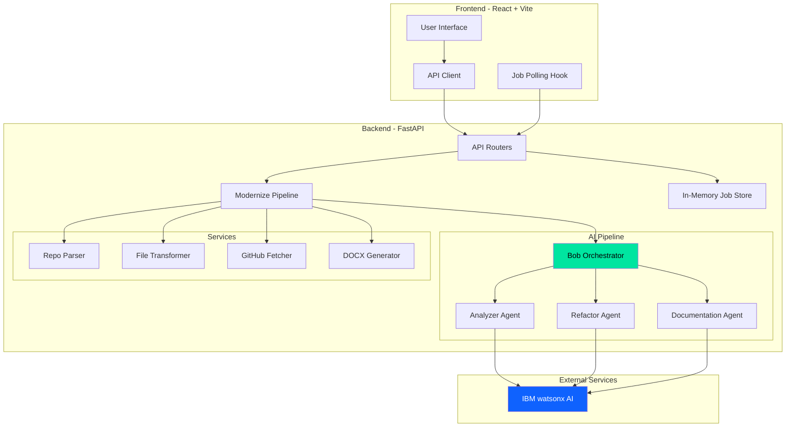
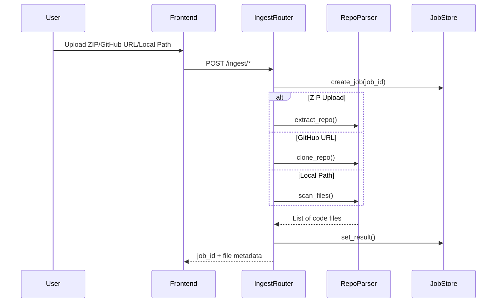
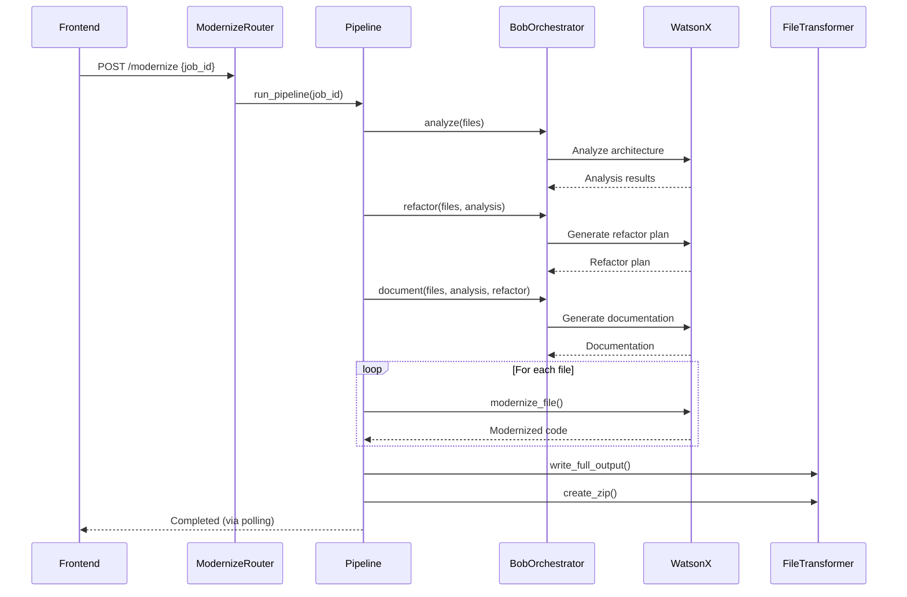

# Legacy Whisperer - Architecture Analysis & Recommendations

## Executive Summary

**Legacy Whisperer** is a full-stack application that leverages IBM watsonx AI to analyze and modernize legacy codebases. The system ingests repositories from multiple sources (GitHub, ZIP, local path), performs AI-driven analysis and refactoring, and generates modernized code with comprehensive documentation.

**Overall Assessment:** ⭐⭐⭐⭐ (4/5)
- Well-structured monorepo with clear separation of concerns
- Effective use of AI agents for code modernization
- Good async/await patterns in Python backend
- Some areas need improvement for production readiness

---

## 1. Architecture Overview

### High-Level Architecture



### Technology Stack

#### Backend
- **Framework:** FastAPI (async Python web framework)
- **AI/ML:** IBM watsonx AI (meta-llama/llama-3-3-70b-instruct)
- **Language:** Python 3.10+
- **Key Libraries:**
  - `ibm-watsonx-ai` - AI model integration
  - `gitpython` - Git operations
  - `pydantic` - Data validation
  - `uvicorn` - ASGI server

#### Frontend
- **Framework:** React 18
- **Build Tool:** Vite 5
- **Language:** JavaScript (ES6+)
- **Styling:** CSS Modules
- **State Management:** React Hooks (useState, useCallback)

#### Infrastructure
- **Backend Deployment:** Railway (https://backend-production-0d82c.up.railway.app)
- **Frontend Deployment:** Vercel
- **Storage:** File system (temporary uploads)

---

## 2. Main Components & Data Flow

### 2.1 Ingestion Flow



### 2.2 Modernization Pipeline Flow



### 2.3 Component Responsibilities

#### Backend Components

| Component | Responsibility | Key Files |
|-----------|---------------|-----------|
| **API Routers** | HTTP endpoint handlers | `routers/ingest.py`, `routers/modernize.py`, `routers/status.py`, `routers/download.py` |
| **Bob Orchestrator** | Coordinates AI agents | `ai_pipeline/bob.py`, `ai_pipeline/bob_orchestrator.py` |
| **Analyzer Agent** | Detects issues, bugs, security risks | `ai_pipeline/agents/analyzer_agent.py` |
| **Refactor Agent** | Creates modernization plan | `ai_pipeline/agents/refactor_agent.py` |
| **Documentation Agent** | Generates technical docs | `ai_pipeline/agents/documentation_agent.py` |
| **Repo Parser** | Scans and extracts code files | `services/repo_parser.py` |
| **File Transformer** | Writes modernized output | `services/file_transformer.py` |
| **Job Store** | In-memory job state management | `services/job_store.py` |
| **Bob Client** | watsonx API wrapper | `services/bob_client.py` |

#### Frontend Components

| Component | Responsibility | Key Files |
|-----------|---------------|-----------|
| **App** | Main orchestrator, phase management | `src/App.jsx` |
| **Upload Phase** | Repository ingestion UI | `src/phases/Upload.jsx` |
| **Analyzing Phase** | Progress tracking with polling | `src/phases/Analyzing.jsx` |
| **Results Phase** | Display analysis results | `src/phases/Results.jsx` |
| **Done Phase** | Completion screen | `src/phases/Done.jsx` |
| **API Client** | Backend communication | `src/api/client.js` |
| **useJobPolling Hook** | Polling logic abstraction | `src/hooks/useJobPolling.js` |

---

## 3. Architectural Patterns & Design Decisions

### 3.1 Design Patterns Identified

#### Backend Patterns

1. **Agent Pattern** (AI Pipeline)
   - Multiple specialized agents (Analyzer, Refactor, Documentation)
   - Orchestrator coordinates agent execution
   - Each agent has single responsibility

2. **Repository Pattern** (Job Store)
   - Abstraction over in-memory storage
   - Thread-safe operations with locks
   - CRUD operations for job management

3. **Pipeline Pattern** (Modernization)
   - Sequential stages with progress tracking
   - Each stage updates job status
   - Error handling at each stage

4. **Async/Await Pattern**
   - Non-blocking I/O operations
   - Background task execution
   - Efficient resource utilization

#### Frontend Patterns

1. **Phase/Wizard Pattern**
   - Multi-step user flow (Upload → Analyzing → Results → Done)
   - State machine for phase transitions
   - Progress visualization

2. **Polling Pattern**
   - Custom hook for job status polling
   - Automatic retry and error handling
   - Configurable intervals

3. **Component Composition**
   - Reusable UI components (Tables, Buttons, Progress bars)
   - Props-based configuration
   - CSS modules for styling

### 3.2 Key Design Decisions

| Decision | Rationale | Trade-offs |
|----------|-----------|------------|
| **In-memory job storage** | Simplicity, fast access | Lost on restart, not scalable |
| **Async pipeline execution** | Non-blocking, better UX | Complexity in error handling |
| **Multi-agent AI architecture** | Separation of concerns, modularity | Multiple API calls to watsonx |
| **File system storage** | Simple, no external dependencies | Not suitable for distributed systems |
| **Polling for status** | Simple, works with any backend | Network overhead, not real-time |
| **Monorepo structure** | Easy development, shared context | Deployment complexity |

---

## 4. Code Quality Assessment

### 4.1 Strengths ✅

1. **Clean Code Structure**
   - Well-organized directory structure
   - Clear separation of concerns
   - Consistent naming conventions

2. **Type Safety**
   - Pydantic models for request/response validation
   - Type hints in Python code
   - Clear API contracts

3. **Error Handling**
   - Try-catch blocks in critical sections
   - Graceful degradation (e.g., DOCX generation)
   - HTTP exception handling

4. **Security Considerations**
   - Path traversal protection in file operations
   - Safe ZIP extraction
   - Environment variable for credentials

5. **Documentation**
   - Comprehensive README files
   - Inline comments for complex logic
   - API documentation via Swagger

### 4.2 Areas for Improvement ⚠️

1. **Limited Test Coverage**
   - No unit tests found
   - No integration tests
   - No CI/CD pipeline

2. **Hard-coded Values**
   - Model ID in `bob_client.py`
   - API base URL in frontend
   - Magic numbers (timeouts, limits)

3. **Error Messages**
   - Some generic error messages
   - Limited context in failures
   - No structured logging

4. **Code Duplication**
   - JSON fence stripping logic repeated
   - Similar error handling patterns
   - Agent base class could be extracted

---

## 5. Security & Scalability Concerns

### 5.1 Security Issues 🔒

| Issue | Severity | Description | Recommendation |
|-------|----------|-------------|----------------|
| **Credentials in .env** | HIGH | API keys stored in plain text | Use secrets manager (AWS Secrets Manager, HashiCorp Vault) |
| **CORS wildcard** | MEDIUM | `allow_origins=["*"]` in production | Restrict to specific domains |
| **No authentication** | HIGH | No user authentication/authorization | Implement OAuth2 or JWT |
| **File upload limits** | MEDIUM | 500KB limit may be bypassed | Add request size validation at API gateway |
| **No rate limiting** | MEDIUM | Vulnerable to abuse | Implement rate limiting middleware |
| **Sensitive data in logs** | LOW | Potential credential leakage | Sanitize logs, use structured logging |

### 5.2 Scalability Concerns 📈

| Issue | Impact | Current Limit | Recommendation |
|-------|--------|---------------|----------------|
| **In-memory job store** | HIGH | Single instance only | Migrate to Redis or database |
| **Synchronous file I/O** | MEDIUM | Blocks event loop | Use async file operations |
| **No job queue** | HIGH | Limited concurrent jobs | Implement Celery or RQ |
| **File system storage** | HIGH | Single server storage | Use S3 or object storage |
| **No caching** | MEDIUM | Repeated API calls | Implement Redis caching |
| **Polling overhead** | LOW | Network traffic | Consider WebSockets or SSE |

### 5.3 Reliability Issues 🔧

1. **No job persistence** - Jobs lost on restart
2. **No retry mechanism** - Failed jobs require manual restart
3. **No health checks** - No monitoring of watsonx availability
4. **No backup strategy** - Uploaded files not backed up
5. **Single point of failure** - No redundancy

---

## 6. Specific Improvement Recommendations

### 6.1 High Priority (Critical) 🔴

#### 1. Implement Persistent Job Storage
```python
# Replace in-memory dict with database
from sqlalchemy import create_engine
from sqlalchemy.orm import sessionmaker

# Use PostgreSQL or MongoDB for job storage
# Benefits: Persistence, scalability, query capabilities
```

**Impact:** Prevents data loss, enables horizontal scaling
**Effort:** 2-3 days
**Dependencies:** PostgreSQL/MongoDB, SQLAlchemy/Motor

#### 2. Add Authentication & Authorization
```python
from fastapi.security import OAuth2PasswordBearer
from jose import JWTError, jwt

# Implement JWT-based authentication
# Add role-based access control (RBAC)
```

**Impact:** Secures API endpoints, enables multi-tenancy
**Effort:** 3-4 days
**Dependencies:** python-jose, passlib

#### 3. Implement Job Queue System
```python
from celery import Celery

# Move pipeline execution to Celery workers
# Benefits: Scalability, retry logic, monitoring
app = Celery('legacy_whisperer', broker='redis://localhost:6379')

@app.task(bind=True, max_retries=3)
def run_modernization_pipeline(self, job_id, repo_id):
    # Pipeline logic here
    pass
```

**Impact:** Enables horizontal scaling, better resource management
**Effort:** 4-5 days
**Dependencies:** Celery, Redis

#### 4. Add Comprehensive Testing
```python
# Unit tests
def test_analyzer_agent():
    agent = AnalyzerAgent(mock_llm)
    result = agent.run([mock_file])
    assert "architecture_issues" in result

# Integration tests
def test_full_pipeline():
    # Test end-to-end flow
    pass
```

**Impact:** Prevents regressions, improves reliability
**Effort:** 5-7 days
**Coverage Target:** 80%+

### 6.2 Medium Priority (Important) 🟡

#### 5. Migrate to Object Storage
```python
import boto3

# Replace file system with S3
s3_client = boto3.client('s3')
s3_client.upload_file(local_path, bucket, key)
```

**Impact:** Scalability, durability, CDN integration
**Effort:** 2-3 days

#### 6. Add Structured Logging & Monitoring
```python
import structlog
from opentelemetry import trace

# Structured logging
logger = structlog.get_logger()
logger.info("pipeline_started", job_id=job_id, files_count=len(files))

# Distributed tracing
tracer = trace.get_tracer(__name__)
with tracer.start_as_current_span("analyze_code"):
    # Analysis logic
    pass
```

**Impact:** Better debugging, performance insights
**Effort:** 2-3 days

#### 7. Implement Caching Layer
```python
import redis
from functools import wraps

redis_client = redis.Redis(host='localhost', port=6379)

def cache_result(ttl=3600):
    def decorator(func):
        @wraps(func)
        def wrapper(*args, **kwargs):
            cache_key = f"{func.__name__}:{hash(str(args))}"
            cached = redis_client.get(cache_key)
            if cached:
                return json.loads(cached)
            result = func(*args, **kwargs)
            redis_client.setex(cache_key, ttl, json.dumps(result))
            return result
        return wrapper
    return decorator
```

**Impact:** Reduced API costs, faster responses
**Effort:** 1-2 days

#### 8. Add Rate Limiting
```python
from slowapi import Limiter
from slowapi.util import get_remote_address

limiter = Limiter(key_func=get_remote_address)

@app.post("/modernize")
@limiter.limit("5/minute")
async def modernize_endpoint():
    pass
```

**Impact:** Prevents abuse, controls costs
**Effort:** 1 day

### 6.3 Low Priority (Nice to Have) 🟢

#### 9. WebSocket Support for Real-time Updates
```python
from fastapi import WebSocket

@app.websocket("/ws/status/{job_id}")
async def websocket_status(websocket: WebSocket, job_id: str):
    await websocket.accept()
    while True:
        status = get_job(job_id)
        await websocket.send_json(status)
        await asyncio.sleep(1)
```

**Impact:** Better UX, reduced network overhead
**Effort:** 2-3 days

#### 10. Add API Versioning
```python
# Version 1
@app.get("/v1/status/{job_id}")
async def get_status_v1():
    pass

# Version 2 with breaking changes
@app.get("/v2/status/{job_id}")
async def get_status_v2():
    pass
```

**Impact:** Backward compatibility, easier migrations
**Effort:** 1-2 days

#### 11. Implement Circuit Breaker for watsonx
```python
from circuitbreaker import circuit

@circuit(failure_threshold=5, recovery_timeout=60)
def call_watsonx_api(prompt):
    # API call logic
    pass
```

**Impact:** Better resilience, graceful degradation
**Effort:** 1 day

#### 12. Add Frontend Error Boundaries
```jsx
class ErrorBoundary extends React.Component {
  componentDidCatch(error, errorInfo) {
    logErrorToService(error, errorInfo);
  }
  
  render() {
    if (this.state.hasError) {
      return <ErrorFallback />;
    }
    return this.props.children;
  }
}
```

**Impact:** Better error handling, improved UX
**Effort:** 1 day

---

## 7. Performance Optimization Opportunities

### 7.1 Backend Optimizations

1. **Batch watsonx API Calls**
   - Current: Sequential file processing
   - Proposed: Batch multiple files in single request
   - Expected improvement: 40-60% faster

2. **Parallel File Processing**
   ```python
   import asyncio
   
   async def process_files_parallel(files):
       tasks = [modernize_file(f) for f in files]
       return await asyncio.gather(*tasks)
   ```
   - Expected improvement: 3-5x faster for large repos

3. **Optimize File I/O**
   - Use async file operations
   - Stream large files instead of loading into memory
   - Implement chunked processing

4. **Database Query Optimization**
   - Add indexes on job_id, status
   - Use connection pooling
   - Implement query result caching

### 7.2 Frontend Optimizations

1. **Code Splitting**
   ```javascript
   const Results = lazy(() => import('./phases/Results'));
   ```
   - Reduce initial bundle size
   - Faster page loads

2. **Memoization**
   ```javascript
   const MemoizedTable = React.memo(PlanTable);
   ```
   - Prevent unnecessary re-renders
   - Smoother UI

3. **Virtual Scrolling**
   - For large file lists
   - Improved performance with 100+ files

---

## 8. Deployment & DevOps Recommendations

### 8.1 CI/CD Pipeline

```yaml
# .github/workflows/ci.yml
name: CI/CD Pipeline

on: [push, pull_request]

jobs:
  test:
    runs-on: ubuntu-latest
    steps:
      - uses: actions/checkout@v2
      - name: Run tests
        run: |
          cd Backend
          pytest --cov=. --cov-report=xml
      
  deploy:
    needs: test
    if: github.ref == 'refs/heads/main'
    runs-on: ubuntu-latest
    steps:
      - name: Deploy to Railway
        run: railway up
```

### 8.2 Infrastructure as Code

```yaml
# docker-compose.yml
version: '3.8'
services:
  backend:
    build: ./Backend
    environment:
      - REDIS_URL=redis://redis:6379
      - DATABASE_URL=postgresql://db:5432/legacy_whisperer
    depends_on:
      - redis
      - db
  
  redis:
    image: redis:7-alpine
  
  db:
    image: postgres:15-alpine
  
  celery:
    build: ./Backend
    command: celery -A services.celery_app worker
```

### 8.3 Monitoring & Observability

```python
# Add Prometheus metrics
from prometheus_client import Counter, Histogram

pipeline_duration = Histogram('pipeline_duration_seconds', 'Pipeline execution time')
api_requests = Counter('api_requests_total', 'Total API requests', ['endpoint', 'status'])
```

---

## 9. Cost Optimization

### Current Cost Drivers
1. **watsonx API calls** - Primary cost
2. **Railway hosting** - Backend infrastructure
3. **Vercel hosting** - Frontend (likely free tier)

### Optimization Strategies

1. **Implement Smart Caching**
   - Cache analysis results for similar code patterns
   - Estimated savings: 30-40%

2. **Batch Processing**
   - Group similar files for single API call
   - Estimated savings: 20-30%

3. **Tiered Processing**
   - Quick scan mode (limited analysis)
   - Full analysis mode (comprehensive)
   - User choice based on needs

4. **Request Deduplication**
   - Detect duplicate file content
   - Skip redundant processing

---

## 10. Migration Path to Production

### Phase 1: Foundation (Weeks 1-2)
- [ ] Set up PostgreSQL database
- [ ] Implement authentication
- [ ] Add comprehensive logging
- [ ] Create test suite (unit + integration)

### Phase 2: Scalability (Weeks 3-4)
- [ ] Implement Celery job queue
- [ ] Migrate to S3 storage
- [ ] Add Redis caching
- [ ] Implement rate limiting

### Phase 3: Reliability (Weeks 5-6)
- [ ] Add health checks
- [ ] Implement circuit breakers
- [ ] Set up monitoring (Prometheus + Grafana)
- [ ] Create backup strategy

### Phase 4: Optimization (Weeks 7-8)
- [ ] Optimize watsonx API usage
- [ ] Implement parallel processing
- [ ] Add WebSocket support
- [ ] Performance testing & tuning

---

## 11. Conclusion

### Summary of Findings

**Strengths:**
- Well-architected multi-agent AI system
- Clean separation of concerns
- Good async patterns
- Effective use of IBM watsonx

**Critical Gaps:**
- No persistent storage
- No authentication
- Limited scalability
- No testing

**Recommended Next Steps:**
1. Implement persistent job storage (PostgreSQL/MongoDB)
2. Add authentication & authorization
3. Set up comprehensive testing
4. Implement job queue (Celery)
5. Add monitoring & logging

### Risk Assessment

| Risk | Probability | Impact | Mitigation |
|------|------------|--------|------------|
| Data loss on restart | HIGH | HIGH | Implement persistent storage |
| Unauthorized access | HIGH | HIGH | Add authentication |
| watsonx API failure | MEDIUM | HIGH | Implement circuit breaker |
| Scalability bottleneck | MEDIUM | MEDIUM | Add job queue |
| Cost overrun | LOW | MEDIUM | Implement caching |

### Final Recommendation

The application has a solid foundation but requires significant hardening for production use. Prioritize security (authentication) and reliability (persistent storage, job queue) before scaling. The AI pipeline architecture is well-designed and should be preserved during refactoring.

**Estimated effort to production-ready:** 8-10 weeks with 2 developers

---

*Analysis completed: 2026-05-17*
*Analyzer: Bob (Plan Mode)*